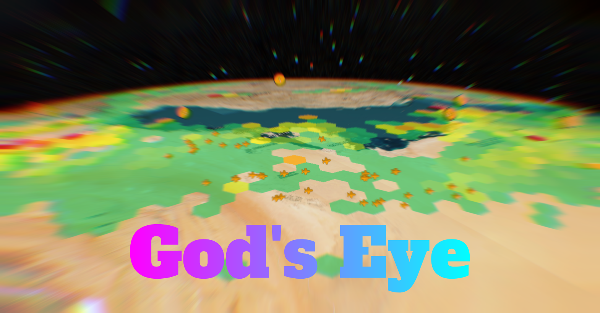
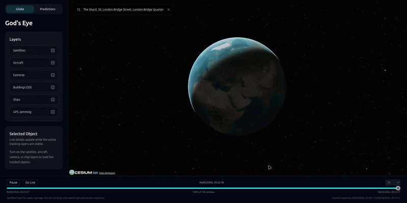
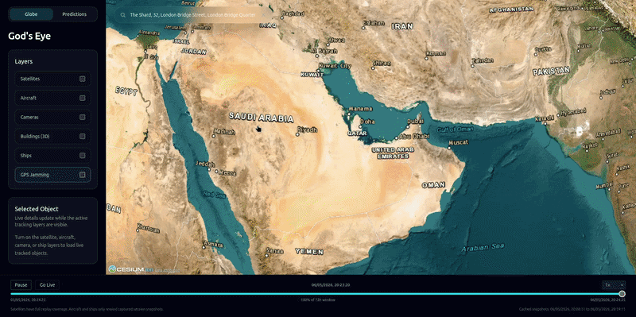

# 🌍 Palantir in your pocket



Air, sea, satellites, cameras, buildings, and prediction markets.

All in one place.

---

# 🎥 Live Demos

## 📡 Satellites



---

## ✈️ Aircraft + GPS Jamming View



---

## 📷 Camera System


---

# 🚀 Quick Start

### 1. Clone the repo

```bash
git clone https://github.com/farmino1/Gods_Eye.git
cd Gods_Eye
````

---

### 2. Install dependencies

```bash
npm install
```

---

### 3. Enable large data files (IMPORTANT)

This project uses Git LFS for large datasets:

```bash
git lfs install
git lfs pull
```

---

### 4. Setup environment

```bash
cp .env.example .env.local
```

Edit `.env.local` and add any API keys you want to use.

---

### 5. Run the app

```bash
npm run dev
```

Open:

```
http://127.0.0.1:5173
```

---

# ⚠️ Common Issues

### ❌ Blank globe / broken JSON error

```bash
git lfs pull
```

---

### ❌ Cesium not loading

```js
window.CESIUM_BASE_URL = "/cesium/";
```

---

# 📦 What this app does

### 🌌 Globe Layers

* Satellites (real orbital data)
* Aircraft (live tracking + GPS jamming visualization)
* Ships (AIS data)
* Cameras (global live feeds)
* Buildings (3D photorealistic tiles)
* Prediction markets

---

# 🧠 Data Behavior

| Layer      | Type         | Replay       |
| ---------- | ------------ | ------------ |
| Satellites | TLE physics  | 72h replay   |
| Aircraft   | live feed    | session only |
| Ships      | live AIS     | session only |
| Cameras    | live catalog | real-time    |

---

# 🧰 Tech Stack

* React + Vite
* Cesium
* Node.js backend proxy
* Zustand
* Tailwind CSS

---

# 📁 Project Structure

```
src/        → frontend app
server/     → backend proxy
public/     → Cesium assets
cameras/    → large camera dataset (LFS)
docs/media/       → documentation + demos
test/       → unit tests
```

---

# 🔐 Environment Variables

Copy `.env.example` → `.env.local`

* `OPENSKY_CLIENT_ID`
* `OPENSKY_CLIENT_SECRET`
* `AISSTREAM_API_KEY`
* `VITE_CESIUM_ION_TOKEN`

---

# 🧪 Development

```bash
npm run dev
npm run test
npm run build
```

---

# 📚 Documentation

* Architecture → `docs/media/ARCHITECTURE.md`
* API → `docs/media/API.md`
* Replay model → `docs/media/REPLAY_MODEL.md`
* Development → `docs/media/DEVELOPMENT.md`

---

# ⚠️ Notes

* Large datasets use Git LFS
* First load may take time due to Cesium assets
* Some features require API keys but core system runs without them